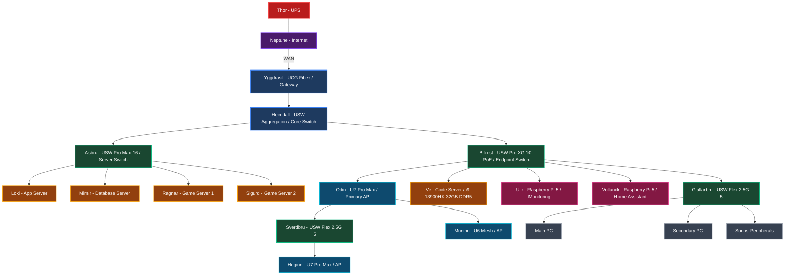

# Hi there, I'm Provant 👋

## About Me

Full-stack developer and infrastructure enthusiast who builds things end-to-end - from network segmentation and server architecture to game servers and web applications. By day, I'm a qualified train driver. By night, I'm building game worlds, tinkering with enterprise-grade homelab infrastructure, and writing code.

I specialise in TypeScript/JavaScript ecosystems with a focus on scalable, secure, and well-architected solutions. Currently working with Bun, React, Supabase, and Cloudflare's platform for web projects, and Java for Minecraft plugin development.

## Currently Working On

- **Pixadom** - A cozy 2D social pixel art MMORPG (Purely community management and consultation)
- **OdysseyCraft** - A comprehensive Minecraft server network with custom plugins and Paper-native architecture
- **Homelab Infrastructure** - Norse themed server cluster with enterprise networking, monitoring, and automation

## Tech Stack

### Languages

### Frontend

### Backend & Runtime

### Databases & Caching

### Cloud & Deployment

### Infrastructure & Networking

### Tools

## Homelab - The Nine Realms

A Norse mythology-themed homelab with enterprise-grade UniFi networking, VLAN segmentation across five realms, and dedicated servers for applications, databases, game hosting, and development.

> **VLAN Segmentation:** Traffic is isolated across five realms - **Asgard** (trusted devices), **Midgard** (guest network), **Jötunheim** (public-facing services), **Svartalfheim** (IoT & isolated devices), and **Alfheim** (kids & monitored devices).

## GitHub Stats

## How to Reach Me

- Website: [provant.dev](https://provant.dev)
- Email: [me@provant.dev](mailto:me@provant.dev)

---
